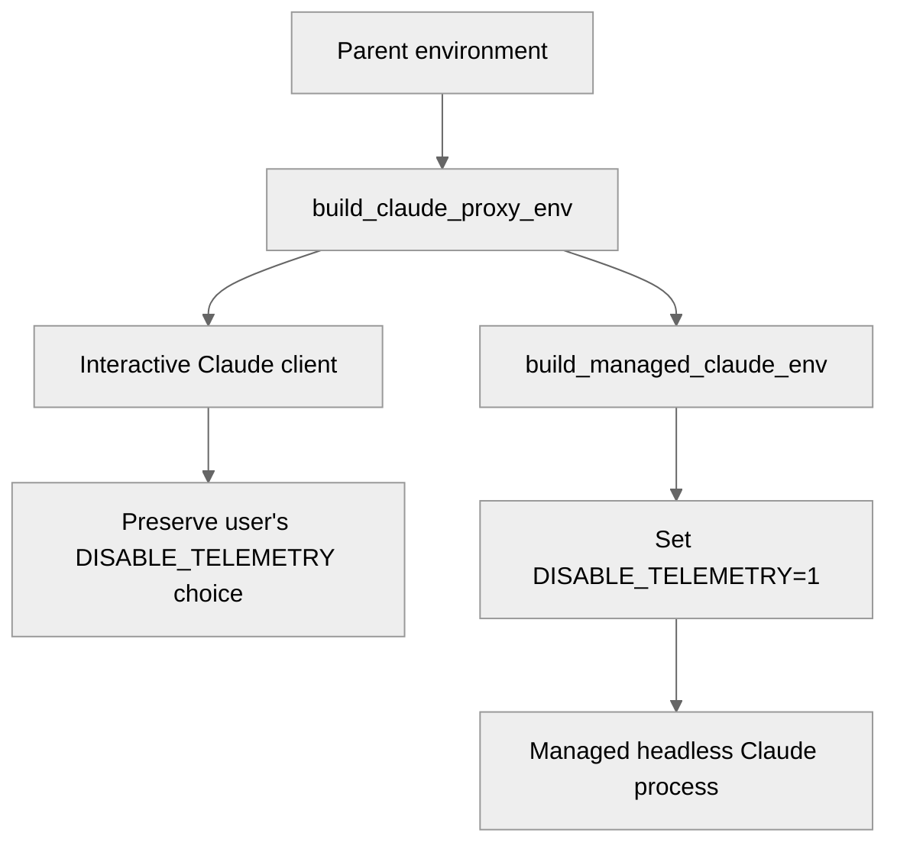

# Recent Activity in Starred Repositories
_130 active repos with 2134 new commits_

## [3d-printing](https://github.com/topics/3d-printing)
- [nicklockwood/ShapeScript](https://github.com/nicklockwood/ShapeScript) [5](https://github.com/nicklockwood/ShapeScript/commits): Update for 1.10.6 release
- [fluidd-core/fluidd](https://github.com/fluidd-core/fluidd) [1](https://github.com/fluidd-core/fluidd/commits): fix(AFC): Not defaulting to black in Print Dialog if lane not loaded (#1905)

Signed-off-by: Jim Madill <jcmadill1@gmail.com>

## [accessibility](https://github.com/topics/accessibility)
- [lycorp-jp/sim-use](https://github.com/lycorp-jp/sim-use) [18](https://github.com/lycorp-jp/sim-use/commits): Merge pull request #61 from lycorp-jp/fix/device-hub-hid-guard

fix: guard every HID verb against Device-Hub-poisoned simulators
- [cjpais/Handy](https://github.com/cjpais/Handy) [3](https://github.com/cjpais/Handy/commits): bump handy keys 0.3.2

## [agent-skills](https://github.com/topics/agent-skills)
- [CherryHQ/cherry-studio](https://github.com/CherryHQ/cherry-studio) [26](https://github.com/CherryHQ/cherry-studio/commits): feat(data-api): add data change notification capability

Add the post-commit main-to-renderer data change notification
infrastructure frozen in the Phase A contract (#17144):

- DataApiDataChangeEffect discriminated union (scalar / projection /
  membership / order) with GetMethodApiPaths derived from GET response
  shapes; illegal states are unrepresentable and the collection
  classification is pinned by a snapshot type test
- notifyDataApiDataChange broadcasts over the single fixed
  DataApi_DataChanged channel behind the application.isReady() delivery
  boundary; failures never reach the committed write path
- renderer DataApiService fan-out (exact endpoint match, one merged
  callback per notification, per-listener error isolation) attached at
  construction, plus the useDataChange hook
- replace the never-shipped subscribe placeholder (IPC channels,
  IpcAdapter handlers, preload subscribe, Subscription types) and drop
  the deprecated zero-consumer cancelRequest / cancelAllRequests /
  getRequestStats
- mocks mirror production semantics through the service mock's single
  fan-out, pinned by a mock-parity test; docs cover governance fences
  and consumer usage
- [alibaba/open-code-review](https://github.com/alibaba/open-code-review) [6](https://github.com/alibaba/open-code-review/commits): fix(vscode): bound brace-expansion resolution to avoid poisoned 5.x (#467)

The resolutions entry "brace-expansion": ">=2.1.2" had no upper bound,
so yarn resolved it to the poisoned 5.0.7 release whose changed export
shape breaks minimatch's default import, crashing `yarn lint` with
"brace_expansion_1.default is not a function".

Bound the range to ">=2.1.2 <3" (keeping the CVE-safe lower bound from
#445) and regenerate yarn.lock. brace-expansion now resolves to 2.1.2
and its transitive balanced-match back to 1.0.2. Lint, compile and the
92 unit tests all pass.

## [ai](https://github.com/topics/ai)
- [BasedHardware/omi](https://github.com/BasedHardware/omi) [276](https://github.com/BasedHardware/omi/commits): fix(desktop-backend): trigger web search for implicit research asks (#10429) (#10439)

retrieval_policy() only injected Anthropic's server-side web_search tool when
the latest user turn matched one of ~16 fixed EXPLICIT_WEB_PHRASES (or the
freshness/anaphoric heuristics). Natural research requests that name a public
web locus but no literal trigger phrase — "find out who David Zhang is ...
every piece of information available on him online", "look them up on the web"
— fell through to auto, so the model got no web tool and told the user it
couldn't search the web, even though the capability was there.

Add a guarded research-intent heuristic: a lookup verb (find out, look up,
research, who is, information about, ...) paired with an explicit online/web
locus ("online", "on the web", "on the internet"), on a turn under the existing
240-char cap. The locus matches on word boundaries so "on the web" does not read
out of "on the webinar", and the length cap keeps long machine-written synthesis
prompts (which never name a web locus about a subject) off the forced-search
path. Explicit private-context requests still take precedence — they return
before this branch — so "what did I say about the pricing I found online?" stays
inside Omi.

The new reason is classified as a non-explicit guess (like Freshness and
AnaphoricLookup), so web_requirement_is_explicit() stays false: a route without
web search (haiku, or the kill switch) degrades to model knowledge instead of
failing the turn.

Tests: 5 regression tests (repro requires web; guess-not-strict; verb+locus both
required; private precedence; long synthesis prompt stays auto). Verified the
repro test fails on the pre-fix classifier and passes after. cargo test 393
passed; cargo clippy --bin -- -D warnings clean; rustfmt clean.

Failure-Class: none
- [openclaw/openclaw](https://github.com/openclaw/openclaw) [217](https://github.com/openclaw/openclaw/commits): feat(ios): deterministically plan App Store releases
- [XiaomiMiMo/MiMo-Code](https://github.com/XiaomiMiMo/MiMo-Code) [38](https://github.com/XiaomiMiMo/MiMo-Code/commits): Merge pull request #1887 from XiaomiMiMo/fix/gpt-subagent-tools

fix(actor): resolve GPT subagent tools by catalog model
- [github/spec-kit](https://github.com/github/spec-kit) [22](https://github.com/github/spec-kit/commits): chore: release 0.14.1, begin 0.14.2.dev0 development (#3698)

* chore: bump version to 0.14.1

* chore: begin 0.14.2.dev0 development

---------

Co-authored-by: github-actions[bot] <41898282+github-actions[bot]@users.noreply.github.com>
- [oraios/serena](https://github.com/oraios/serena) [11](https://github.com/oraios/serena/commits): TypeScript: make the tsserver progress-start grace configurable, raise the default

find_referencing_symbols/request_references could return incomplete results on
large TypeScript projects. _wait_for_indexing_start_or_completion waits only
_INDEXING_START_GRACE_S (hardcoded 2.0s) for tsserver to *start* emitting
$/progress after opening files; if nothing has appeared by then, it assumes no
indexing is needed and proceeds immediately. On a large project, tsserver can
take longer than that just to resolve the project graph before it even creates
the first progress token, so the first cross-file reference query can race a
project that is still loading.

Every caller of _wait_for_indexing_start_or_completion (the base TypeScript
path and the Svelte companion) always calls expect_indexing() first, so the
"no progress observed" branch is reached specifically when indexing is already
expected; it cannot distinguish "nothing to do" from "not started yet",
because the two look identical from the client for as long as tsserver stays
quiet. That ambiguity cannot be resolved from client-observable signals alone,
so this makes the grace an ls_specific_settings knob (`indexing_start_grace`),
the same way indexing_timeout and server_ready_timeout already are, and raises
the default from 2.0s to 5.0s.

Fixes #1586
- [steipete/oracle](https://github.com/steipete/oracle) [9](https://github.com/steipete/oracle/commits): chore(changelog): open 0.16.2
- [docling-project/docling](https://github.com/docling-project/docling) [7](https://github.com/docling-project/docling/commits): fix: guard scipy import in to avoid crash in docling-slim[service-client] (#3860)

fix: guard scipy import in video_frame_sampling to avoid crash in slim installs

Signed-off-by: Cesar Berrospi Ramis <ceb@zurich.ibm.com>
- [google-gemini/gemini-cli](https://github.com/google-gemini/gemini-cli) [7](https://github.com/google-gemini/gemini-cli/commits): feat(caretaker-triage): post comment before auto-closing issues (#28411)
- [lutzroeder/netron](https://github.com/lutzroeder/netron) [3](https://github.com/lutzroeder/netron/commits): Update onnx-metadata.json
- [pykeio/ort](https://github.com/pykeio/ort) [3](https://github.com/pykeio/ort/commits): feat: `Tensor::size`
- [zylon-ai/private-gpt](https://github.com/zylon-ai/private-gpt) [3](https://github.com/zylon-ai/private-gpt/commits): chore: enable preview with forks (#2308)
- [Kiln-AI/Kiln](https://github.com/Kiln-AI/Kiln) [2](https://github.com/Kiln-AI/Kiln/commits): Merge pull request #1619 from Kiln-AI/dchiang/desktop-build-on-dep-prs

CI: run Build Desktop Apps on dependency PRs

## [android](https://github.com/topics/android)
- [droidrun/mobilerun](https://github.com/droidrun/mobilerun) [11](https://github.com/droidrun/mobilerun/commits): chore(release): bump to 0.6.12

chore(release): bump to 0.6.12
- [Snapchat/Valdi](https://github.com/Snapchat/Valdi) [9](https://github.com/Snapchat/Valdi/commits): Closes https://github.com/Snapchat/Valdi/pull/117

GitOrigin-RevId: ab6a0c8b50a3d2a317f97bb309e8ee6d899d28e4
- [Julow/Unexpected-Keyboard](https://github.com/Julow/Unexpected-Keyboard) [1](https://github.com/Julow/Unexpected-Keyboard/commits): Make the keyboard smaller on modern phones (#1367)

The keyboard height was proportional to the height of the screen. This
was when the most popular ratio was 16:9. The formula is changed to work
with modern phones that have a ratio of 19:9 or bigger.

The option in the settings is no longer a % of the height of the screen
but a % of an arbitrary unit.

## [clickhouse](https://github.com/topics/clickhouse)
- [chdb-io/chdb](https://github.com/chdb-io/chdb) [8](https://github.com/chdb-io/chdb/commits): Merge pull request #616 from chdb-io/feat/chdb-durable

feat: add chdb.durable — Durable Analytical Object subpackage
- [ClickHouse/adsb.exposed](https://github.com/ClickHouse/adsb.exposed) [6](https://github.com/ClickHouse/adsb.exposed/commits): Merge pull request #67 from ClickHouse/close-error-message

Add a close button to the error message

## [deep-learning](https://github.com/topics/deep-learning)
- [skypilot-org/skypilot](https://github.com/skypilot-org/skypilot) [13](https://github.com/skypilot-org/skypilot/commits): [Test] okta smoke: don't gate login success on the in-app dashboard redirect (#10188)

* [Test] okta smoke: don't gate login success on the in-app dashboard redirect

test_helm_deploy_okta's OAuth verification waited (up to 60s) for the
browser URL to become `/dashboard/clusters`, i.e. for the dashboard's
client-side redirect (`/dashboard/` -> `/dashboard/clusters`) to fire.
That in-app navigation is cosmetic and can occasionally stall under load
(a dynamically-imported chunk fails to load), leaving the browser parked
on an already-authenticated `/dashboard/` page. Login has clearly
succeeded at that point, but the check times out and the test fails
spuriously.

Verify what the test actually cares about instead: that OAuth served an
authenticated `/dashboard*` page (not the IdP), then navigate to
`/dashboard/clusters` with a full-page load and confirm the dashboard
rendered via the existing SkyPilot-logo check. This drops the dependency
on the flaky client-side redirect.

Repro: run `pytest tests/smoke_tests/test_images.py::test_helm_deploy_okta
--kubernetes` repeatedly under load; the pre-fix check intermittently
times out waiting for `/dashboard/clusters` while the browser is already
authenticated on `/dashboard/`.

Co-Authored-By: Claude Opus 4.8 (1M context) <noreply@anthropic.com>
Claude-Session: https://claude.ai/code/session_01JjGDE8YL4b39f23goaU9b9

* [Test] okta smoke: guard current_url read used only for logging

current_url can raise or return None mid-navigation under load (per the
Step 3 comment); wrap the logging-only read so it cannot fail the check.

Co-Authored-By: Claude Opus 4.8 (1M context) <noreply@anthropic.com>
Claude-Session: https://claude.ai/code/session_01JjGDE8YL4b39f23goaU9b9

---------

Co-authored-by: Claude Opus 4.8 (1M context) <noreply@anthropic.com>
- [HeyWillow/willow](https://github.com/HeyWillow/willow) [8](https://github.com/HeyWillow/willow/commits): ethernet: enable SNTP and timezone

The Ethernet path skipped the shared SNTP lifecycle, so it neither
applied the configured timezone nor synchronized the system clock.

Expose the helpers and initialize SNTP before bringing up the W5500
interface. Start it after the existing connection wait. The shared
configuration already selects the Ethernet IP event.
- [microsoft/qlib](https://github.com/microsoft/qlib) [1](https://github.com/microsoft/qlib/commits): feat(config): add explicit validation for required configuration fields (#2078)

* feat(config): add explicit validation for required configuration fields

* feat(config): add explicit validation for required configuration fields

* fix(config): always validate configuration regardless of registration

* config: clarify validation semantics and document future migration plan

* fix: pylint error

---------

Co-authored-by: Linlang <Lv.Linlang@hotmail.com>
- [Qengineering/Jetson-Nano-image](https://github.com/Qengineering/Jetson-Nano-image) [1](https://github.com/Qengineering/Jetson-Nano-image/commits): Revise installation instructions in README.md

Updated download links and clarified installation instructions.

## [embedded](https://github.com/topics/embedded), [usb](https://github.com/topics/usb)
- [linux-msm/qdl](https://github.com/linux-msm/qdl) [3](https://github.com/linux-msm/qdl/commits): Merge pull request #297 from igoropaniuk/fix/provision-sector-probe

firehose: do not probe sector size when storage init is skipped
- [hathach/tinyusb](https://github.com/hathach/tinyusb) [1](https://github.com/hathach/tinyusb/commits): Merge pull request #3631 from rhgndf/apm32f072

Add support for APM32F072

## [javascript](https://github.com/topics/javascript)
- [highlightjs/highlight.js](https://github.com/highlightjs/highlight.js) [5](https://github.com/highlightjs/highlight.js/commits): enh(dos): add `batch` as language alias (#4452)

Allow language:batch / class batch for DOS batch file highlighting.
Closes #4395.
- [alyssaxuu/screenity](https://github.com/alyssaxuu/screenity) [1](https://github.com/alyssaxuu/screenity/commits): Drive upload reliability, visible editor errors, and faster cloud recording starts

## [llm](https://github.com/topics/llm)
- [NousResearch/hermes-agent](https://github.com/NousResearch/hermes-agent) [360](https://github.com/NousResearch/hermes-agent/commits): chore: map kinsonnee@gmail.com -> WOLIKIMCHENG for #59526 salvage
- [kortix-ai/suna](https://github.com/kortix-ai/suna) [104](https://github.com/kortix-ai/suna/commits): Merge pull request #5314 from kortix-ai/fix-session-provisioning

Fix dev session provisioning and terminal startup state
- [jjang-ai/vmlx](https://github.com/jjang-ai/vmlx) [59](https://github.com/jjang-ai/vmlx/commits): docs: refresh vMLX 1.6.16 corrected artifact proof
- [BerriAI/litellm](https://github.com/BerriAI/litellm) [48](https://github.com/BerriAI/litellm/commits): Merge pull request #33978 from BerriAI/litellm_cost_optimization_tools

feat(cost-optimization): add spend-by-tool and cache leakage views
- [jundot/omlx](https://github.com/jundot/omlx) [26](https://github.com/jundot/omlx/commits): feat: deny the LSP tool when launching Claude Code to keep the prefix cache stable
- [unslothai/unsloth](https://github.com/unslothai/unsloth) [25](https://github.com/unslothai/unsloth/commits): Normalize PWD for POSIX agent launches (#7110)

Keep the child process environment consistent with the cwd used to launch native POSIX coding agents. Some Node-based agents use PWD during project-root discovery, so inheriting a stale PWD can make them edit files in a parent or unrelated directory even when the wrapper process cwd is correct.

Only apply this normalization for native POSIX launches. WSL-launched Windows shims stay on the existing WSLENV bridge path so path translation behavior is unchanged.

Add regression coverage that launches an agent with a deliberately stale inherited PWD and asserts the child environment is normalized to os.getcwd().

Co-authored-by: Leo Borcherding <borchborchmail@gmail.com>
- [browser-use/browser-use](https://github.com/browser-use/browser-use) [24](https://github.com/browser-use/browser-use/commits): Keep selector indices unique across CDP sessions (#5291)

## Summary

Prevents interactive elements from overwriting each other when separate
CDP sessions reuse the same `backendNodeId`.

This is intentionally separate from the extraction-filter fixes in
#5290. Each PR is independently reviewable; together they fix the
supplied nested payment iframe repro end-to-end.

## Changes

- Preserve backend IDs as selector indices when unique; allocate a
positive collision-free index above all reserved backend IDs only on
collision.
- Collect reserved IDs in one linear traversal.
- Use the selector-map index consistently in DOM text, Python screenshot
overlays, and browser-side debug highlights.
- Resolve action validation/retry messages back to the model-visible
selector index.
- Scope coordinate lookup cache matches by CDP session as well as
backend ID.
- Track new-node identity by `(session_id, backend_node_id)`.

## Reproduction

The supplied payment page produced duplicate IDs such as `[7]` for both
the CVV iframe and Pay button. The selector map retained only one, so a
model action could target the wrong element. A BU2 run on #5290 alone
reproduced this and failed after eight steps.

With this PR combined with #5290, BU2 filled cardholder, expiry, nested
card number, and nested CVV by index, clicked Pay, and reached `PAYMENT
SUBMITTED`.

## Tests

- `uv run pytest -q
tests/ci/browser/test_dom_selector_index_collisions.py
tests/ci/browser/test_dom_serializer.py
tests/ci/test_coordinate_clicking.py` (39 passed)
- Combined with #5290: 41 focused tests passed
- `uv run pre-commit run --all-files` (passed)

This addresses the prior Cubic findings on quadratic ID collection,
model/backend ID mismatch in action errors, and coordinate lookup
ambiguity.

<!-- This is an auto-generated description by cubic. -->
---
## Summary by cubic
Keep selector indices unique across CDP sessions to prevent
cross-origin/backendNodeId collisions that caused elements to overwrite
each other. Highlights, DOM text, action messages, pagination/dropdown
metadata, and overlays now show the same collision-free selector index.

- **Bug Fixes**
- Preserve backend IDs when unique; on collisions, assign a synthetic
index above all reserved IDs collected in one traversal.
- Track node identity by `(session_id, backend_node_id)`; scope
backend-ID resolution, coordinate lookups, and transient highlights by
the node’s CDP session; add `BrowserSession.get_selector_index` and a
per-session index cache.
- Prefer same-frame matches when remapping historical actions by
reordering candidates before hash/XPath/AX/name checks.
- Use the selector index everywhere: DOM/eval serializer output, Python
screenshot overlays, JS highlight labels/data attributes, watchdog
messages, and dropdown/pagination responses (expose both
`backend_node_id` and `selector_index`).
- Bind prompt-selected `Element`s and interaction highlights to the
selected node’s CDP session for OOPIF correctness; add regression tests
for collisions, frame preference, overlays/highlights, pagination
metadata, and session binding.

<sup>Written for commit 5a4b02c4bdc0da6f988cd818c42cb85d895a8b06.
Summary will update on new commits.</sup>

<a
href="https://cubic.dev/pr/browser-use/browser-use/pull/5291?utm_source=github"
target="_blank" rel="noopener noreferrer"
data-no-image-dialog="true"><picture><source
media="(prefers-color-scheme: dark)"
srcset="https://www.cubic.dev/buttons/review-in-cubic-dark.svg"><source
media="(prefers-color-scheme: light)"
srcset="https://www.cubic.dev/buttons/review-in-cubic-light.svg"></picture></a>

<!-- End of auto-generated description by cubic. -->
- [langgenius/dify](https://github.com/langgenius/dify) [24](https://github.com/langgenius/dify/commits): feat(dataset): add source connections (#39319)

Co-authored-by: autofix-ci[bot] <114827586+autofix-ci[bot]@users.noreply.github.com>
- [google/adk-python](https://github.com/google/adk-python) [20](https://github.com/google/adk-python/commits): fix: bypass Protobuf Gencode/Runtime version check in antigravity integration

Set TEMPORARILY_DISABLE_PROTOBUF_VERSION_CHECK environment variable before loading google.antigravity to prevent version errors when installed alongside google-cloud-aiplatform (which caps protobuf at <7.0.0).

Co-authored-by: Shangjie Chen <deanchen@google.com>
PiperOrigin-RevId: 953000596
- [screenpipe/screenpipe](https://github.com/screenpipe/screenpipe) [18](https://github.com/screenpipe/screenpipe/commits): fix(ci): regenerate stale Cargo.lock files and make release bumps regenerate all of them (#5402)

* fix: regenerate stale Cargo.lock files after v0.4.29 workspace bump

Commit 265ac2454 bumped the workspace version to 0.4.29 in root
Cargo.toml and regenerated root Cargo.lock, but left the nested
lockfiles stale, breaking 'cargo test --locked' on main:

- packages/sdk/Cargo.lock: workspace path-deps at 0.4.28
- packages/sdk/examples/tauri-app/src-tauri/Cargo.lock: stale since 0.4.25
- apps/screenpipe-app-tauri/src-tauri/Cargo.lock: path-deps at 0.4.27,
  app's own version at 2.5.131 (Cargo.toml says 2.5.133)

All 6 tracked Cargo.lock locations now pass 'cargo metadata --locked'.

Co-Authored-By: Claude Fable 5 <noreply@anthropic.com>

* fix: make release bumps regenerate all tracked Cargo.lock files

Fix the class behind the v0.4.29 breakage, not just the instance:
version bumps (release-app / release-cli) edited only Cargo.toml, so the
other cargo workspaces' tracked locks went stale and every
'cargo {test,build} --locked' CI job on main broke.

- scripts/regenerate-locks.sh: canonical mechanism — regenerates (or with
  --check verifies) every tracked Cargo.lock, discovered via git ls-files
  so the list can't drift when new workspaces are added
- .claude/skills/release/SKILL.md: mandatory regen step after any bump
  (app or CLI), plus a troubleshooting entry for the --locked error
- .github/workflows/style.yml: 'lockfiles' job runs the --check mode on
  every push/PR so a stale lock fails fast instead of breaking main

Audit of bump surfaces: release-*.yml workflows only read versions
(never edit), no bump scripts in scripts/; the skills were the only
producers.

Co-Authored-By: Claude Fable 5 <noreply@anthropic.com>

---------

Co-authored-by: Claude Fable 5 <noreply@anthropic.com>
- [gptme/gptme](https://github.com/gptme/gptme) [16](https://github.com/gptme/gptme/commits): feat(tui): prefix-based history search + show Ctrl+J in input hint (#3341)

* feat(tui): prefix-based history search + show Ctrl+J in input hint

When pressing Up with a partial text typed, only show history entries
that start with that prefix — matching the prompt-toolkit CLI behavior
described in #3311 ('no history/prefix matching like CLI').

Also updates both inline and normal-mode hint text from 'Alt+Enter for
newline' to 'Ctrl+J / Alt+Enter for newline', making the reliable
cross-terminal fallback visible to users.

Closes #3311

* fix(tui): key history edits by entry string to prevent cross-search leak

`_history_edits` was keyed by integer position within the current filter.
When the prefix changed, position 0 in the new filter was a different entry
than position 0 in the old filter — so an edit made during one prefix search
would appear verbatim when navigating the next.

Fix: key by the original entry string. Edits on "git status" persist across
Down/Up of the same search, but can never collide with "docker ps" at the
same index position.

Add `test_history_prefix_search_no_edit_leak` to guard against regression.

* test(tui): update snapshots for Ctrl+J hint
- [openai/openai-agents-python](https://github.com/openai/openai-agents-python) [7](https://github.com/openai/openai-agents-python/commits): feat: consistently accept typed objects and dictionaries for SDK configuration (#3917)
- [OpenHands/OpenHands](https://github.com/OpenHands/OpenHands) [3](https://github.com/OpenHands/OpenHands/commits): fix(app-server): persist combined LLM usage metrics across all usage buckets (#15354)
- [halfrost/Halfrost-Field](https://github.com/halfrost/Halfrost-Field) [2](https://github.com/halfrost/Halfrost-Field/commits): add article 2
- [hiyouga/EasyR1](https://github.com/hiyouga/EasyR1) [1](https://github.com/hiyouga/EasyR1/commits): [docs] promote PenguinHarness in readme (#11006)

Co-authored-by: Claude Fable 5 <noreply@anthropic.com>

## [macos](https://github.com/topics/macos)
- [pranshuparmar/witr](https://github.com/pranshuparmar/witr) [30](https://github.com/pranshuparmar/witr/commits): Merge pull request #214 from pranshuparmar/claude/playground-analytics

feat: Add anonymous analytics via GoatCounter
- [trycua/cua](https://github.com/trycua/cua) [22](https://github.com/trycua/cua/commits): CUA-953: Package Fleet SDK native libraries in cua-train wheels (#5995)

* feat(cua-953): package Fleet SDK native wheels

* fix(cua-953): use supported Intel macOS runners

* fix(cua-953): install required Rust components

---------

Co-authored-by: coding-sub-agent <coding-sub-agent@trycua.com>
CloudCyclopsCs-RevId: 9e9dd405d8b3eca3aed165bdb1cbcf384cd31771
- [acsandmann/rift](https://github.com/acsandmann/rift) [9](https://github.com/acsandmann/rift/commits): feat: follow window to workspace
- [MarkEdit-app/MarkEdit](https://github.com/MarkEdit-app/MarkEdit) [4](https://github.com/MarkEdit-app/MarkEdit/commits): Extensions empty state improvements (#1605)
- [FluidInference/FluidAudio](https://github.com/FluidInference/FluidAudio) [3](https://github.com/FluidInference/FluidAudio/commits): fix(tts/kokoro-ane): throw instead of trapping on non-finite PostAlbert durations (#816)

## Summary

Fixes the hard crash reported in #738
([comment](https://github.com/FluidInference/FluidAudio/issues/738#issuecomment-5063569059)):
on iOS 27 public beta, Kokoro synthesis kills the host app with

```
Fatal error: Float value cannot be converted to Int32 because it is either infinite or NaN
```

at `KokoroAneSynthesizer.swift:74` (`d=NaN`).

## Root cause

iOS 27's new E5 CoreML runtime flags the dynamic-shape Kokoro stages at
load time (`MIL program has non-constant (dynamic) shapes for external
input but FlexibleShapeInformation attribute is missing`) and then
mis-executes them — PostAlbert returns NaN for its `duration` output.
The `pred_dur` conversion did `Int32(Float(d).rounded())`, which is a
Swift runtime trap on NaN, so the whole host app crashed instead of
receiving an error. Same class of on-device dynamic-shape misbehavior as
#739 (there the symptom was zeros; here NaNs).

## Change

- Extract the rounding into
`KokoroAneSynthesizer.predictedDurations(from:)`:
- throws new `KokoroAneError.nonFiniteModelOutput(stage:output:)` on
NaN/±inf, with a message pointing at the iOS 27 runtime and #738
- clamps finite values to `[1, maxAcousticFrames]` so huge garbage
values can't trap `Int32()` either; absurd totals still surface through
the existing `acousticFramesExceedCap` check
- Output for well-formed durations is byte-identical (small positive
floats, far below the cap).
- Unit tests for rounding/clamping/NaN/inf paths — pure function, no
models needed.

This makes the failure catchable; it does **not** make Kokoro work on
iOS 27 betas. The model-side fix (attaching flexible-shape info so E5
compiles the dynamic stages correctly) is separate follow-up work.
Affected users can try `KokoroAneComputeUnits.cpuAndGpu` as a possible
workaround.

## Testing

- `swift build` clean, `swift format lint` clean
- New `KokoroAnePredictedDurationTests` (run on CI; no model downloads
required)
- [Beingpax/VoiceInk](https://github.com/Beingpax/VoiceInk) [1](https://github.com/Beingpax/VoiceInk/commits): Add debug storage failure reproduction markers

## [mqtt](https://github.com/topics/mqtt)
- [emqx/CocoaMQTT](https://github.com/emqx/CocoaMQTT) [11](https://github.com/emqx/CocoaMQTT/commits): Merge pull request #720 from emqx/fix/mqtt-retry-protocol-compliance

Fix MQTT retransmission semantics
- [esphome/esphome](https://github.com/esphome/esphome) [11](https://github.com/esphome/esphome/commits): [bk72xx_ble] BLE controller support for BK72xx (BLE 5.x) (#17775)
- [openshwprojects/OpenBK7231T_App](https://github.com/openshwprojects/OpenBK7231T_App) [3](https://github.com/openshwprojects/OpenBK7231T_App/commits): Trim optional drivers when MQTT_USE_TLS is enabled to fix BK7231N TCM linker overflow
- [arendst/Tasmota](https://github.com/arendst/Tasmota) [2](https://github.com/arendst/Tasmota/commits): Bump version v15.5.0.2

## [pdf](https://github.com/topics/pdf)
- [pymupdf/PyMuPDF](https://github.com/pymupdf/PyMuPDF) [5](https://github.com/pymupdf/PyMuPDF/commits): changes.txt: various updates.
- [microsoft/markitdown](https://github.com/microsoft/markitdown) [1](https://github.com/microsoft/markitdown/commits): fix: handle PPTX SVG images without a rasterized fallback (#2233)

* fix: handle PPTX SVG images without a rasterized fallback

PowerPoint stores an SVG picture as an <a:blip> whose r:embed points to a
raster PNG fallback plus an <asvg:svgBlip> extension for the SVG. When a
picture has no raster fallback, the <a:blip> has no r:embed, so
python-pptx's shape.image raises ValueError("no embedded image"). This
caused PptxConverter to fail the entire conversion.

Resolve the SVG part directly from the svgBlip extension via a new
_get_image_info helper, and guard _is_picture against the exception
(hasattr only swallows AttributeError). Add unit tests plus a small
synthetic PPTX fixture covering the SVG-without-fallback case.

* style: apply black formatting to _pptx_converter.py

---------

Co-authored-by: Guoyu Wang <gwang@microsoft.com>

## [python](https://github.com/topics/python)
- [doronz88/pymobiledevice3](https://github.com/doronz88/pymobiledevice3) [26](https://github.com/doronz88/pymobiledevice3/commits): Merge pull request #1801 from doronz88/chore/report-deprecated

typing: enforce reportDeprecated and fix the 7 flagged sites
- [vinta/awesome-python](https://github.com/vinta/awesome-python) [3](https://github.com/vinta/awesome-python/commits): Add kaydet (#3263)
- [shorepine/tulipcc](https://github.com/shorepine/tulipcc) [2](https://github.com/shorepine/tulipcc/commits): Merge pull request #1225 from shorepine/button_events_retry

amyboard.py: Added Encoder.button_event().

## [queue](https://github.com/topics/queue)
- [apple/swift-collections](https://github.com/apple/swift-collections) [12](https://github.com/apple/swift-collections/commits): Merge pull request #694 from lorentey/container-updates
- [bloomberg/blazingmq](https://github.com/bloomberg/blazingmq) [5](https://github.com/bloomberg/blazingmq/commits): Test: Fuzz PutMessageIterator (#1590)

Signed-off-by: Jake Jendzurski <jakeski2015@gmail.com>
Signed-off-by: Patrick M. Niedzielski <pniedzielski@bloomberg.net>
Co-authored-by: Patrick M. Niedzielski <pniedzielski@bloomberg.net>

## [rust](https://github.com/topics/rust)
- [embassy-rs/embassy](https://github.com/embassy-rs/embassy) [14](https://github.com/embassy-rs/embassy/commits): Merge pull request #6590 from xoviat/stm32

stm32: update deps
- [HaoboGu/rmk](https://github.com/HaoboGu/rmk) [4](https://github.com/HaoboGu/rmk/commits): Clarify role of SHIFTED (#996)
- [tokio-rs/mio](https://github.com/tokio-rs/mio) [4](https://github.com/tokio-rs/mio/commits): Use checkout v7 for Wine job

Fixes a warning about using Node.js v20.
- [ast-grep/ast-grep](https://github.com/ast-grep/ast-grep) [3](https://github.com/ast-grep/ast-grep/commits): 0.45.0
bump version
- [nextest-rs/nextest](https://github.com/nextest-rs/nextest) [3](https://github.com/nextest-rs/nextest/commits): [nextest-metadata] add MismatchReason::is_substantive_skip (#3483)

Going to use this in #3472.

This is pure refactoring with no functional changes.
- [dora-rs/dora](https://github.com/dora-rs/dora) [2](https://github.com/dora-rs/dora/commits): ci(nightly): give the Windows Multiple Daemons example more build headroom (#2742) (#2812)

ci(nightly): give the Windows Multiple Daemons example more build headroom

`cargo run --example multiple-daemons` triggers `dora build`, which recompiles
the node/operator crates (zenoh, arrow, rustls, quinn) from scratch in release.
On a cold Windows runner that can exceed the 30-min step budget — the
2026-07-23 nightly was force-killed mid-zenoh-compile. Raise the step to 45 min
and the job cap 90->120 so the from-scratch build sequence fits without masking
a genuine hang.

Refs #2742

Co-authored-by: Claude Opus 4.8 (1M context) <noreply@anthropic.com>
- [wasmi-labs/wasmi](https://github.com/wasmi-labs/wasmi) [2](https://github.com/wasmi-labs/wasmi/commits): Add `InstanceEntity` handle cache with eager warm-up (#1991)

* make StoreInner use StableArena for most things

* fix StoreInner internal resolution API

* add HandleAndCache

* add HandleAndCache to InstanceEntity

* add StoreInner::[try_]resolve_instance_mut

* use &mut InstanceEntity for Inst in executor

* add as_ptr_mut and as_mut methods to Inst type

* add missing inline annotations

* make HandleAndCache return reference instead of options

* add new InstanceEntity API to load using its cache

* fix broken intra doc links

* partially use new instance cache in executor

* return Option from HandleAndCache API

* remove commented out line of code

* switch to eager initialization for InstanceEntity cache

* adjust executor for caching changes

* rename methods for better parity

* add missing docs and inline

* use InstanceEntity::entry helper in more places

* add low-level utils::load_x_ptr helpers to executor

these allow using the instance cache in more places.

* use the instance cache in more places in the executor

* remove no longer used StoreInner APIs

* rename InstanceEntity::*_v2 methods to `*_ptr`

* rename Resolve[Mut] assoc methods

* create Inst from &InstanceEntity (again)

no more need to have mutable InstanceEntity with eager caching

* remove StoreInner::[try_]resolve_instance_mut

* remove unused Inst::{as_ptr_mut,as_mut} methods

* fix bug in {memory,table}.copy with aliasing imports

* add regression test for aliased memory imports

* add StoreInner::[try_]resolve_*_ptr methods

* use StoreInner::resolve_*_ptr methods to fix UB

* remove unused StoreInner methods
- [denoland/rusty_v8](https://github.com/denoland/rusty_v8) [1](https://github.com/denoland/rusty_v8/commits): v150.3.0 (#2028)
- [sharkdp/fd](https://github.com/sharkdp/fd) [1](https://github.com/sharkdp/fd/commits): Merge pull request #2066 from sharkdp/dependabot/github_actions/softprops/action-gh-release-3.0.2

build(deps): bump softprops/action-gh-release from 3.0.1 to 3.0.2
- [YuhanLiin/micropb](https://github.com/YuhanLiin/micropb) [1](https://github.com/YuhanLiin/micropb/commits): Merge pull request #43 from joelsa/feat/service-codegen-hooks

feat(micropb-gen): add service codegen extension points

## [wearable](https://github.com/topics/wearable), [wearables](https://github.com/topics/wearables)
- [Mentra-Community/MentraOS](https://github.com/Mentra-Community/MentraOS) [62](https://github.com/Mentra-Community/MentraOS/commits): Merge pull request #3580 from Mentra-Community/aisraelov/evaluate-text-mode-crops

Improve text mode small-text crops
- [OpenStrap/edge](https://github.com/OpenStrap/edge) [11](https://github.com/OpenStrap/edge/commits): Merge pull request #133 from dannymcc/fix/workout-max-hr-spike

fix(workout): suppress PPG spikes in the workout max HR (#127)

## Other
- [QwenLM/qwen-code](https://github.com/QwenLM/qwen-code) [58](https://github.com/QwenLM/qwen-code/commits): feat(serve): scope channel lifecycle to workspace runtimes (#7577)

* feat(serve): manage channel instances through daemon

* fix(serve): scope channel lifecycle by workspace

* fix(serve): contain targeted channel reloads

* test(serve): use manageable channel fixture

* fix(serve): harden workspace channel lifecycle

* fix(serve): serialize workspace channel mutations

Keep owner-scoped channel selection read-modify-write operations inside the manager lane so concurrent workspace lifecycle updates cannot drop channels.

* fix(serve): reject reserved channel removal

* test(serve): cover trimmed channel sentinel

Exercise the exported helper directly so whitespace handling regressions fail independently of selection normalization.

* test(serve): cover channel diagnostic recovery

* fix(serve): retain channel reload diagnostics
- [espressif/esp-idf](https://github.com/espressif/esp-idf) [53](https://github.com/espressif/esp-idf/commits): Merge branch 'feature/isp-flash-dma-input' into 'master'

feat(isp): add aligned flash DMA input example

See merge request espressif/esp-idf!50959
- [openai/codex](https://github.com/openai/codex) [43](https://github.com/openai/codex/commits): Expose Browser Use requirements through the app server (#35033)

## What changed

- Parse the `browser_use.disable_auto_review` setting from layered
  `requirements.toml` configuration.
- Return the setting as `browserUse.disableAutoReview` from
  `configRequirements/read` and publish it in the generated JSON and TypeScript
  schemas.

## Testing

- Add an app-server RPC test covering the Browser Use requirement.

GitOrigin-RevId: 5749d5bc17bcc5b582bf7ed59b8e5b72d6c8f7fc
- [block/buzz](https://github.com/block/buzz) [28](https://github.com/block/buzz/commits): fix: expose community icon control on open relays (#2640)

Signed-off-by: npub1cl47vfhsqpqy9pwndphpm36vcp7vvz5h2js4qpqm5yewzj7nutkq7xyw8c <c7ebe626f000404285d3686e1dc74cc07cc60a9754a150041ba132e14bd3e2ec@buzz.block.builderlab.xyz>
Co-authored-by: npub1cl47vfhsqpqy9pwndphpm36vcp7vvz5h2js4qpqm5yewzj7nutkq7xyw8c <c7ebe626f000404285d3686e1dc74cc07cc60a9754a150041ba132e14bd3e2ec@buzz.block.builderlab.xyz>
- [facebook/idb](https://github.com/facebook/idb) [26](https://github.com/facebook/idb/commits): Use the default app when no bundle id is specified for `app` context

Summary:
### This diff

* Updates `idb-repl` to accept an `app` context with no bundle id.
* Adds app installation for the default `ReplHost` app when no other app is specified for the `app` context.

Reviewed By: bryanyantx

Differential Revision: D113353092

fbshipit-source-id: ae99adf16097576cca97f1968576458e42e7df64
- [jdx/mise](https://github.com/jdx/mise) [21](https://github.com/jdx/mise/commits): fix(npm): surface aube install error chain instead of opaque message (#11226)
- [Automattic/simplenote-macos](https://github.com/Automattic/simplenote-macos) [14](https://github.com/Automattic/simplenote-macos/commits): Upgrade to the Sentry 2.x fastlane plugin (#1274)
- [huggingface/lerobot](https://github.com/huggingface/lerobot) [11](https://github.com/huggingface/lerobot/commits): feat(dataset): add slice support to LeRobotDataset.__getitem__ (#4129)

* feat(dataset): add efficient slice support

* fix(dataset): handle empty dataset slices

* refactor(dataset): reuse scalar path for slices

---------

Co-authored-by: Francesco Capuano <fc.francescocapuano@gmail.com>
- [openclaw/imsg](https://github.com/openclaw/imsg) [11](https://github.com/openclaw/imsg/commits): chore: start 0.13.4 development
- [cline/cline](https://github.com/cline/cline) [10](https://github.com/cline/cline/commits): fix(schedules): default headless routines to yolo (#12489)

* fix(schedules): default headless routines to yolo

Centralize the Cline default model ID in @cline/shared while preserving the @cline/llms export. Keep explicit modes stable and disable ask_question for unattended scheduled runs.

* autoapprove

* fix unit test

* fix(schedules): harden headless routine execution

---------

Co-authored-by: Saoud Rizwan <7799382+saoudrizwan@users.noreply.github.com>
- [buildroot/buildroot](https://github.com/buildroot/buildroot) [9](https://github.com/buildroot/buildroot/commits): package/bind: security bump version to 9.20.26

https://downloads.isc.org/isc/bind9/9.20.26/doc/arm/html/notes.html#notes-for-bind-9-20-26
https://downloads.isc.org/isc/bind9/9.20.26/doc/arm/html/changelog.html
https://seclists.org/oss-sec/2026/q3/208

Fixes

CVE-2026-10723: Incorrect acceptance of NSEC3 records
CVE-2026-10822: Key Record using PRIVATEDNS algorithm may lead to unexpected exit
CVE-2026-11331: Potential wildcard CNAME RPZ policy bypass
CVE-2026-11605: Unnecessary validation of DNSSEC signed records
CVE-2026-11622: Potential memory usage beyond configured limits
CVE-2026-11721: Cache poisoning possible with label count discrepancy, RRSIG, and wildcards
CVE-2026-12617: Record ordering based unexpected exit with CNAME or DNAME
CVE-2026-13204: Unexpected exit in certain situations with NSEC and NSEC3 both present
CVE-2026-13321: DNSSEC Validation Bypass via Out-of-Zone NSEC Next Field

Signed-off-by: Bernd Kuhls <bernd@kuhls.net>
[Julien: update pgp key id in hash file comment]
Signed-off-by: Julien Olivain <ju.o@free.fr>
- [ghostty-org/ghostty](https://github.com/ghostty-org/ghostty) [8](https://github.com/ghostty-org/ghostty/commits): Fix desktop detection tests when running from Gnome (#13434)

Environment variables from the "real" environment leaked into the test
after the Zig 0.16 update which would cause them to fail if you ran them
on a Gnome system.
- [larksuite/cli](https://github.com/larksuite/cli) [8](https://github.com/larksuite/cli/commits): docs(base): clarify complete and partial updates (#1993)

* docs(base): clarify complete and partial updates

Consolidate the update rule introduced in #1879 and make the command-contract boundary explicit. Full-update commands must use trusted current configuration for the first actual request, while delta commands should send the smallest legal payload.

* docs(base): clarify full-update state preservation

Address review feedback by requiring unchanged writable configuration to remain intact, except when the requested update makes a setting inapplicable.

* docs(base): strengthen update contract guidance
- [cmliu/edgetunnel](https://github.com/cmliu/edgetunnel) [7](https://github.com/cmliu/edgetunnel/commits): Merge pull request #1394 from cmliu/beta2.1

Beta2.1
- [crosspoint-reader/crosspoint-reader](https://github.com/crosspoint-reader/crosspoint-reader) [7](https://github.com/crosspoint-reader/crosspoint-reader/commits): fix: STR_RESTARTING_HINT text overflow bug (#2692)

## Summary
fix #2021
- [kohya-ss/sd-scripts](https://github.com/kohya-ss/sd-scripts) [7](https://github.com/kohya-ss/sd-scripts/commits): Merge pull request #2411 from kohya-ss/dev

Add per-subset timestep sampling offset and update documentation
- [steipete/agent-scripts](https://github.com/steipete/agent-scripts) [6](https://github.com/steipete/agent-scripts/commits): docs(codex-first): coordinator-mode learnings from sidebar flattening series
- [verl-project/verl](https://github.com/verl-project/verl) [6](https://github.com/verl-project/verl/commits): [trainer] fix: isolate TaskRunner logs from root logger changes (#7133)

### What does this PR do?

This PR prevents `verl.*` INFO and WARNING logs in `TaskRunnerV1` from
disappearing after vLLM server initialization. The vLLM OpenAI/SageMaker
reconfigures the process root logger and its existing handlers to
`ERROR` by default. Since verl loggers previously propagated to root,
subsequent trainer logs were filtered out.
The change configures a dedicated `verl` namespace handler at the
beginning of `TaskRunnerV1.run()`, after Ray redirects worker stderr and
before trainer/vLLM imports. It respects `VERL_LOGGING_LEVEL` and
disables propagation from the `verl` namespace to root.

### Test

E2E separate async tested. Logs now appear.
- [anthropics/claude-cookbooks](https://github.com/anthropics/claude-cookbooks) [5](https://github.com/anthropics/claude-cookbooks/commits): Merge pull request #793 from anthropics/cj-ant/crop-tool-zoom

Rewrite the crop-tool cookbook around a measured zoom tool
- [xinnan-tech/xiaozhi-esp32-server](https://github.com/xinnan-tech/xiaozhi-esp32-server) [5](https://github.com/xinnan-tech/xiaozhi-esp32-server/commits): Merge pull request #3300 from xinnan-tech/test/manager-api-runtime-warnings

test(manager-api): 清理测试运行告警
- [espressif/esp-bsp](https://github.com/espressif/esp-bsp) [4](https://github.com/espressif/esp-bsp/commits): Merge pull request #799 from espressif/petr/fix/ft5x06_cpp

Match struct elements order in the default config define
- [espressif/esp-matter](https://github.com/espressif/esp-matter) [4](https://github.com/espressif/esp-matter/commits): Merge branch 'ci/certificate_test_failure' into 'main'

CI: Mark pipeline failure when certificate tests fail

See merge request app-frameworks/esp-matter!1594
- [gperftools/gperftools](https://github.com/gperftools/gperftools) [4](https://github.com/gperftools/gperftools/commits): cmake: win32: pull some windows dlls more correctly

See https://github.com/gperftools/gperftools/pull/1637 the context.

Apparently when using GNU ld previously used link_library incantation
added those library dependencies early to the link line. And we need
them after common.lib to actually have linker find the required
things.
- [lijigang/ljg-skills](https://github.com/lijigang/ljg-skills) [4](https://github.com/lijigang/ljg-skills/commits): feat: sync ljg-* skills [ljg-push] (v1.17.72)
- [RfidResearchGroup/proxmark3](https://github.com/RfidResearchGroup/proxmark3) [4](https://github.com/RfidResearchGroup/proxmark3/commits): Merge pull request #3425 from nuschpl/fb-1

proxmark3 classic doesn't have JTAG RST lines routed at all so there …
- [signalapp/libsignal](https://github.com/signalapp/libsignal) [4](https://github.com/signalapp/libsignal/commits): node: Support SVR2 enclave migration
- [the-via/keyboards](https://github.com/the-via/keyboards) [4](https://github.com/the-via/keyboards/commits): Delete v3/cipulot/ec_bevel_proto directory
- [wtfutil/wtf](https://github.com/wtfutil/wtf) [4](https://github.com/wtfutil/wtf/commits): Upgrade go-github v32 to v89 and shurcooL/githubv4 (#2121)

- Update go-github from v32.1.0 to v89.0.0
- Migrate auth from oauth2 transport to NewClient option functions
  (WithAuthToken, WithEnterpriseURLs)
- Update shurcooL/githubv4 from Aug 2020 to Feb 2026 pseudo-version
- Remove unused oauth2 import from modules/github/github_repo.go

Co-authored-by: Seanstoppable <seanstoppable@users.noreply.github.com>
- [XiaoMi/xiaomi-miloco](https://github.com/XiaoMi/xiaomi-miloco) [3](https://github.com/XiaoMi/xiaomi-miloco/commits): Merge pull request #452 from XiaoMi/fix/log-tab-flash-stale-cache

fix(web): 修复日志 tab 切换时历史日志闪现后变空白
- [yaqwsx/KiKit](https://github.com/yaqwsx/KiKit) [3](https://github.com/yaqwsx/KiKit/commits): Cast duplicated zones for KiCad 10.0.5
- [astral-sh/ty](https://github.com/astral-sh/ty) [2](https://github.com/astral-sh/ty/commits): Bump version to 0.0.63 (#4071)

Co-authored-by: Alex Waygood <Alex.Waygood@Gmail.com>
- [FreeRTOS/FreeRTOS-Kernel](https://github.com/FreeRTOS/FreeRTOS-Kernel) [2](https://github.com/FreeRTOS/FreeRTOS-Kernel/commits): Add comment explaining ACL permissions revocation (#1421)

Adds a simple comment mentioning the requirement
for the privileged task to revoke permissions before
deleting an object.
- [openclaw/gogcli](https://github.com/openclaw/gogcli) [2](https://github.com/openclaw/gogcli/commits): docs: changelog entry for empty --tab validation
- [ophub/amlogic-s9xxx-armbian](https://github.com/ophub/amlogic-s9xxx-armbian) [2](https://github.com/ophub/amlogic-s9xxx-armbian/commits): Update dtb files
- [sonocotta/esp32-audio-dock](https://github.com/sonocotta/esp32-audio-dock) [2](https://github.com/sonocotta/esp32-audio-dock/commits): Add built squeezelite binaries, latest templates and NVS settings binaries
- [TactilityProject/Tactility](https://github.com/TactilityProject/Tactility) [2](https://github.com/TactilityProject/Tactility/commits): T-Deck Max & Pro support updates (#582)

- Created kernel driver for T-Deck Max & Pro display (needs work, doesn't refresh reliably on T-Deck Pro)
- Created T-Deck Pro device implementation (incubating)
- [typst/typst](https://github.com/typst/typst) [2](https://github.com/typst/typst/commits): Add `angle` argument to `tiling` (#8621)

Co-authored-by: Tobias Schmitz <tobiasschmitz2001@gmail.com>
- [xbst/KUSBA](https://github.com/xbst/KUSBA) [2](https://github.com/xbst/KUSBA/commits): Update README.md
- [a2aproject/A2A](https://github.com/a2aproject/A2A) [1](https://github.com/a2aproject/A2A/commits): chore: daily docs link check workflow (#2059)

fixes #2036

This PR reworks the Lychee automation workflow:

* Replaces the old source-file link checker with a daily workflow that
builds the MkDocs site and checks rendered HTML
* Adds a two-pass confirmation step (90s wait + cache clear + re-run) to
reduce false positives before failing or opening issues
* On confirmed failure (scheduled runs only): opens/reuses a Link
Checker Report issue
* On success (scheduled runs only): auto-closes any open link checker
issue
* Expands `lychee.toml` with timeouts, retries, caching, and excludes
for sites that block or flake in CI
* Fixes several broken doc links found during testing

---------

Signed-off-by: Aron Kerekes <arkereke@cisco.com>
Co-authored-by: gemini-code-assist[bot] <176961590+gemini-code-assist[bot]@users.noreply.github.com>
Co-authored-by: Luca Muscariello <muscariello@ieee.org>
- [Alishahryar1/free-claude-code](https://github.com/Alishahryar1/free-claude-code) [1](https://github.com/Alishahryar1/free-claude-code/commits): Preserve Claude feature flags in interactive clients (#1239)

## Problem

`fcc-claude` and the documented IDE setups forced `DISABLE_TELEMETRY=1`.
Claude Code disables feature-flag fetching with that variable, so
rollout features such as fullscreen rendering and mouse support fell
back to disabled defaults. Fixes #1238.

## Changes

| Before | After |
| --- | --- |
| Shared proxy policy forced telemetry off for interactive and managed
Claude sessions. | Interactive Claude sessions preserve the user's
telemetry choice, while managed headless tasks own the opt-out. |
| VS Code and JetBrains examples disabled Claude feature-flag fetching.
| Both IDE examples allow Claude to fetch rollout feature flags. |
| Environment contracts expected every Claude surface to disable
telemetry. | Regression tests distinguish interactive inheritance from
managed enforcement. |
| Package metadata reported version 4.12.0. | Package metadata and the
lockfile report version 4.12.1. |

<!-- greptile_comment -->

<details open><summary><h3>Greptile Summary</h3></summary>

Preserve users' telemetry preferences in interactive Claude clients
while continuing to disable telemetry in managed headless sessions.
- Removes the shared `DISABLE_TELEMETRY=1` override and the equivalent
IDE setup examples.
- Adds the telemetry opt-out specifically to managed Claude
environments.
- Updates regression tests to distinguish interactive inheritance from
managed enforcement.
- Bumps package and lockfile metadata from 4.12.0 to 4.12.1.
</details>

<h3>Confidence Score: 5/5</h3>

The PR appears safe to merge, with interactive inheritance and managed
telemetry enforcement consistently implemented and tested.

The interactive launcher now passes through the parent telemetry
preference, while the only managed subprocess path applies its telemetry
opt-out after constructing the shared environment and passes that
environment directly to process creation.

No files require additional attention.

<details><summary><h3><a href="https://www.greptile.com/trex"></a> T-Rex Logs</h3></summary>

**What T-Rex did**
- Compared the pre-change HEAD^ state to the new HEAD, confirming
DISABLE\_TELEMETRY handling now preserves inherited values, omits when
not inherited, forces 1 for managed environments and invocations, and
removes the traffic-suppression flag, resulting in all six checks
passing with exit code 0.

<a
href="https://app.greptile.com/trex/runs/15618944/artifacts"><picture><source
media="(prefers-color-scheme: dark)"
srcset="https://greptile-static-assets.s3.amazonaws.com/badges/ViewAllArtifactsDark.svg?v=4"><source
media="(prefers-color-scheme: light)"
srcset="https://greptile-static-assets.s3.amazonaws.com/badges/ViewAllArtifacts.svg?v=4"></picture></a>

<sub><a href="https://www.greptile.com/trex"></a> Ran code and verified through
T-Rex</sub>
</details>

<details open><summary><h3>Important Files Changed</h3></summary>

| Filename | Overview |
|----------|----------|
| src/free_claude_code/cli/claude_env.py | Removes the shared telemetry
override so interactive Claude launches inherit the parent environment.
|
| src/free_claude_code/cli/managed/claude.py | Restores the telemetry
opt-out specifically for managed headless Claude subprocesses. |
| tests/cli/test_entrypoints.py | Verifies that interactive clients
preserve an explicit telemetry setting and leave an absent setting
unset. |
| tests/cli/test_managed_claude.py | Verifies that managed sessions
enforce the noninteractive telemetry policy. |
| README.md | Removes telemetry-disabling configuration from the
documented VS Code and JetBrains interactive setups. |
| pyproject.toml | Bumps the project version to 4.12.1. |
| uv.lock | Synchronizes the editable project package version without
changing dependency resolutions. |

</details>

<details open><summary><h3>Flowchart</h3></summary>


</details>

<sub>Reviews (1): Last reviewed commit: ["fix: preserve Claude
interactive
feature..."](https://github.com/alishahryar1/free-claude-code/commit/cddcf0d61639a33aba46cac3f7bcbe0274cbcc60)
| [Re-trigger
Greptile](https://app.greptile.com/api/retrigger?id=46750932)</sub>

<!-- /greptile_comment -->
- [anthropics/buffa](https://github.com/anthropics/buffa) [1](https://github.com/anthropics/buffa/commits): release: v0.9.1 (#335)

Cuts v0.9.1, a patch release driven by #331 — a regression 0.9.0
introduced.

## Why now

0.9.0's element-memory bound is sized for untrusted wire input, and
buffa's own tooling applied it to the descriptor sets it reads. Codegen
started rejecting schemas of a few hundred `.proto` files with `element
memory limit exceeded`, which is a small enough schema to hit in
ordinary use. #332 fixed it; this ships it.

Three other changes ride along: the field-scoped open-enum reflection
fix (#321), the view unknown-field pointer change (#329, ~10% faster
view decode on payloads carrying no unknown fields), and a documentation
correction described below.

## The documentation correction

0.9.0's notes said of the element-memory budget that "the owned, view
and reflective (`DynamicMessage`) decoders are all bounded". That is
true, and it reads as codec-independent, which it isn't — JSON decoding
runs `serde_json` straight into the generated `Deserialize` impls, which
never receive a `DecodeOptions`. A message parsed from JSON is bounded
by none of the limits that bound the same message parsed from protobuf,
and the amplification is nearly as large there: `{}` is three JSON bytes
for the element footprint that costs two on the wire.

Shipping a release *about* the element-memory bound while the docs
overstate which codecs it covers seemed like the wrong pairing, so this
adds the scope to `DecodeOptions`, to `with_element_memory_limit`, and
to the guide — which was also missing `with_element_memory_limit` from
its decode-options table entirely. Actually bounding the JSON path is a
real design decision and stays in #330 for 0.10.0. No behaviour changes
here.

## Version choice

0.9.1 rather than 0.10.0. The only API changes are additive
(`DescriptorPool::decode_with_options` and the new `buffa-codegen`
decode helpers), and #329's restructuring touches a private field with
no public signature change — I checked rather than assumed. That matches
the convention stated in the changelog header: breaking changes
increment the minor, additive changes the patch.

## Verification

Ran the CI invocations locally:

- `cargo clippy --workspace --all-targets --all-features -- -D warnings`
— clean
- `cargo test --workspace --all-features` — 49 suites, 0 failures
- `RUSTDOCFLAGS="-D warnings" cargo doc --workspace --all-features
--no-deps` — clean
- `changie merge` is idempotent against the committed `CHANGELOG.md`, so
`check-changelog` passes
- `scripts/check-publish-coverage.sh` — 8 crates listed and publishable
- markdownlint clean on the changed files; the new guide anchor resolves

The only warning anywhere is the documented `editions_2024.proto` skip
from a protoc older than v30, which is expected outside CI. Conformance
was not run locally (no Docker or local runner here); CI covers it.

## Reviewer notes

- **Consumers must regenerate** to get the fix on the generated-code
path: `descriptor_pool()` now scales its decode bound to the bytes
embedded in it, and code generated by 0.9.0 keeps the old bound. The
`buffa-build` and plugin fixes apply on rebuild alone. The release notes
say this.
- **The publish workflow has changed since it last ran successfully.**
#323, #324 and #325 all modified `publish-crates.yml` after the v0.9.0
tag, so this tag is the first to exercise the current version. #324's
bug was a duplicate `env:` key that made the workflow *silently fail to
start* — worth watching the run rather than assuming it. The
`lint-workflows` actionlint job added in #324 guards that specific class
now.

Draft pending review.
- [antirez/ds4](https://github.com/antirez/ds4) [1](https://github.com/antirez/ds4/commits): Fix batched server session recovery race
- [apple/swift-async-algorithms](https://github.com/apple/swift-async-algorithms) [1](https://github.com/apple/swift-async-algorithms/commits): Fix filename typo and template placeholder in Evolution docs (#445)

Rename 0016-mutli-producer-single-consumer-channel.md to the
correctly spelled 0016-multi-...; the document's own proposal link
already uses the correct spelling and currently 404s. Fill in the
NNNN template placeholder in 0017-map-error.md's proposal link.

Co-authored-by: Claude Fable 5 <noreply@anthropic.com>
- [binwiederhier/ntfy](https://github.com/binwiederhier/ntfy) [1](https://github.com/binwiederhier/ntfy/commits): Do not include secrets in the config hash
- [brianpetro/obsidian-smart-connections](https://github.com/brianpetro/obsidian-smart-connections) [1](https://github.com/brianpetro/obsidian-smart-connections/commits): Improved menu actions organization
- [databendlabs/openraft](https://github.com/databendlabs/openraft) [1](https://github.com/databendlabs/openraft/commits): feat: add heartbeat_min_interval to suppress redundant heartbeats

# Summary

Add a `heartbeat_min_interval` config option that suppresses the
periodic heartbeat to a follower that has recently acknowledged an
RPC. A replication response proves the same liveness facts as a
heartbeat response and already updates the leader lease, so the
heartbeat is redundant. Defaults to 0, which keeps current behavior.

# Details

The heartbeat broadcast in RaftCore now skips a follower whose last
acknowledged RPC (replication or heartbeat) was sent within
`heartbeat_min_interval` milliseconds, decided by the new
`Leader::need_heartbeat()` against `clock_progress`, which records the
sending time of the last acknowledged RPC. Under sustained writes this
eliminates most heartbeat RPCs; heartbeats resume automatically once
replication idles.

Config validation enforces
`heartbeat_interval + heartbeat_min_interval < election_timeout_min`
via the new `ConfigError::HeartbeatMinIntervalTooLarge`, so
suppression can never delay a heartbeat past a follower's election
timeout.

- Part: #1853
- [google-deepmind/gemma](https://github.com/google-deepmind/gemma) [1](https://github.com/google-deepmind/gemma/commits): Cleanup protocols naming and convert Union types to Protocols.

PiperOrigin-RevId: 952686087
- [kostub/iosMath](https://github.com/kostub/iosMath) [1](https://github.com/kostub/iosMath/commits): Label ink-aware sizing + device-pixel rounding (#263)

* [item 16] Report ink-aware, device-pixel-rounded size from the label

Route sizeThatFits:/intrinsicContentSize through displayList.inkWidth
instead of the pen-advance width, and round the reported size up to
the device-pixel grid via a new ceilToPixel/screenScale pair. Adds
iosMath/render/internal/MTMathUILabelInternal.h as the internal
test/compose surface for screenScale (displayList is already public,
so it is not redeclared there).

Also redeclares sizeThatFits: in the new internal header: it is
UIView public API on iOS but has no NSView equivalent declaration on
macOS, so external callers (including this PR's tests) could not see
it there without this forward declaration. No behavior change beyond
this file's scope.

* [item 17] Align center/right by inkWidth so trailing ink stays in frame

layoutSubviews' center/right textX branches previously keyed off the
pen-advance _displayList.width, so a trailing overhang glyph (e.g. the
serif foot of 'V') could clip past the frame's right edge even though
sizeThatFits: (item 16) already grew the frame to cover that ink.
Switch both branches to _displayList.inkWidth; left alignment and all
textY math are unchanged.

Also forward-declares layoutSubviews in MTMathUILabelInternal.h: like
sizeThatFits:, it's public UIView API on iOS but only implemented (not
declared) on macOS, where NSView has no equivalent — needed so the new
test can drive layout directly and cross-platform.

* [item 18] Re-query intrinsic size on window/backing-scale change

Add lifecycle overrides so the label invalidates its intrinsic content
size when the window (and therefore the backing/screen scale) changes:
didMoveToWindow on iOS, viewDidMoveToWindow + viewDidChangeBackingProperties
on macOS. Without this, sizing computed before a scale is known (or before
the real backing scale becomes available) can go stale and never get
re-queried by Auto Layout.

* [item 19] Assert ink-clip render guarantees the feature actually provides

Cluster B previously asserted zero ink in the top border pixel row, which
flush ink-tight tall constructs (\int_0^1, \frac{1}{2}) legitimately violate.
Replace it with the real guarantee: the reported size is pixel-aligned and
trailing ink stays inside the right border. The fractional-origin hairline is
deferred per LLD 2.8.


Co-authored-by: Claude Opus 4.8 <noreply@anthropic.com>
- [nordicsemi/nrfx](https://github.com/nordicsemi/nrfx) [1](https://github.com/nordicsemi/nrfx/commits): nrfx 4.5.0 release

Signed-off-by: Nikodem Kastelik <nikodem.kastelik@nordicsemi.no>
- [openclaw/acpx](https://github.com/openclaw/acpx) [1](https://github.com/openclaw/acpx/commits): chore(release): prepare acpx 0.12.1
- [panva/jose](https://github.com/panva/jose) [1](https://github.com/panva/jose/commits): refactor: avoid 32-bit truncation of the AES-CBC-HMAC AAD bit length
- [pointfreeco/sqlite-data](https://github.com/pointfreeco/sqlite-data) [1](https://github.com/pointfreeco/sqlite-data/commits): Add sectioning to `@FetchAll` (#505)

* Add sectioning to `@FetchAll`

* Doc updates and fixes

* wip

* bump

* Fix

* wip

* wip

* Revert "wip"

This reverts commit 4e91397f332e5bec94a8ccb7671ba2526140b7ec.

* Fix for 26.x

---------

Co-authored-by: Brandon Williams <mbrandonw@hey.com>
- [RedisBloom/RedisBloom](https://github.com/RedisBloom/RedisBloom) [1](https://github.com/RedisBloom/RedisBloom/commits): MOD-13409 Harden RDB loading (#1038)

* MOD-13409 Validate Bloom RDB bitset size on load (#126)

* MOD-13409 Validate Bloom RDB bitset size on load

Reject crafted module payloads where the loaded bloom bitset buffer length does not match the declared bits/n2, and add a flow regression test covering RESTORE with a corrupted DUMP payload.

* MOD-13409 clang-format rebloom.c

Run clang-format on rebloom.c to satisfy make lint formatting checks.

* MOD-13409 Validate Bloom RDB bitset length on load

Reject crafted module payloads where persisted bits do not match the loaded bitset buffer length, preventing OOB access after RESTORE.

* Mod 13409 rdb hardening (#127)

* MOD-13409 clang-format rebloom.c

Run clang-format on rebloom.c to satisfy make lint formatting checks.

* MOD-13409 Harden CF RDB load buffer validation

Replace assert-only checks in CFRdbLoad with explicit validation of loaded sizes and ranges, and add a flow test that corrupts a CF DUMP payload to ensure RESTORE is rejected.

* MOD-13409 Harden remaining RDB loaders (TDigest)

TDigest RDB loading trusted attacker-controlled cap, which could desync the allocated centroid arrays from the loaded metadata and enable OOB access after RESTORE.

Reject payloads where loaded cap differs from the allocated cap derived from compression, validate node counters, and add a flow regression that corrupts a TDigest DUMP payload and asserts RESTORE is rejected.

With the earlier BF/CF fixes, this covers all remaining module data structures that load raw buffers from RDB/RESTORE (CMS/TopK already validate buffer sizes).

* Revert "MOD-13409 clang-format rebloom.c"

This reverts commit 456e53503f51b68c4d7a9df988e50a36adf2e61a.

* MOD-13409 Add regression for published P88W exploit

* MOD-13409 Share RDB corruption test helpers

* Fix TDigest RDB load node count overflow check

Avoid signed overflow when validating merged and unmerged node counts by widening the addition.
- [smithy-lang/smithy](https://github.com/smithy-lang/smithy) [1](https://github.com/smithy-lang/smithy/commits): Clean orphaned endpoint ruleset params after shape removal (#3219)

* Clean orphaned endporint ruleset params after shape removal

* Add changelog entry

* Improve variable naming, add implicit param checking in tests, add param checking in leaf rules
- [sushi-labs/sushiswap](https://github.com/sushi-labs/sushiswap) [1](https://github.com/sushi-labs/sushiswap/commits): fix(web): prevent token import actions overflow (#2197)